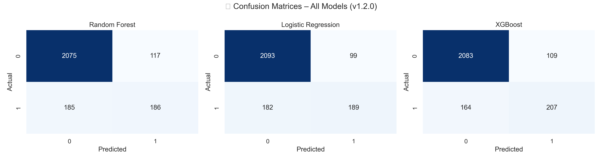
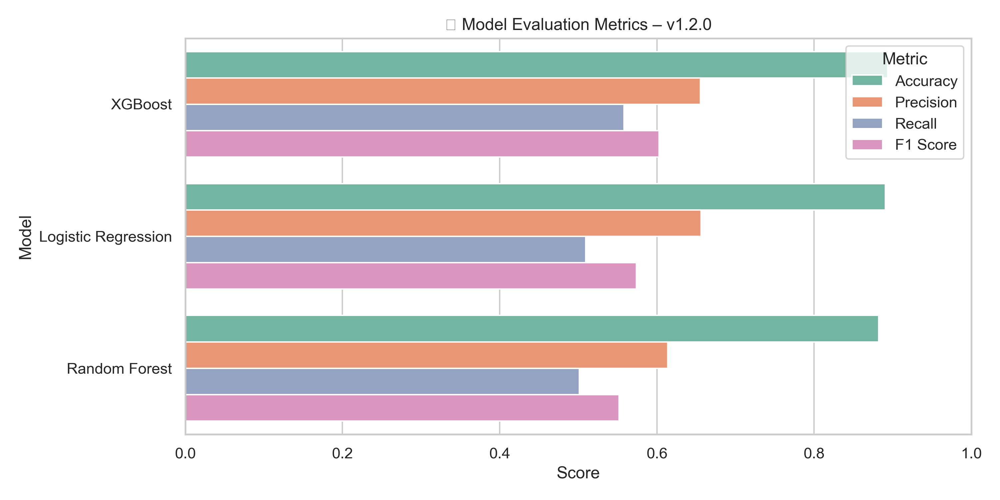
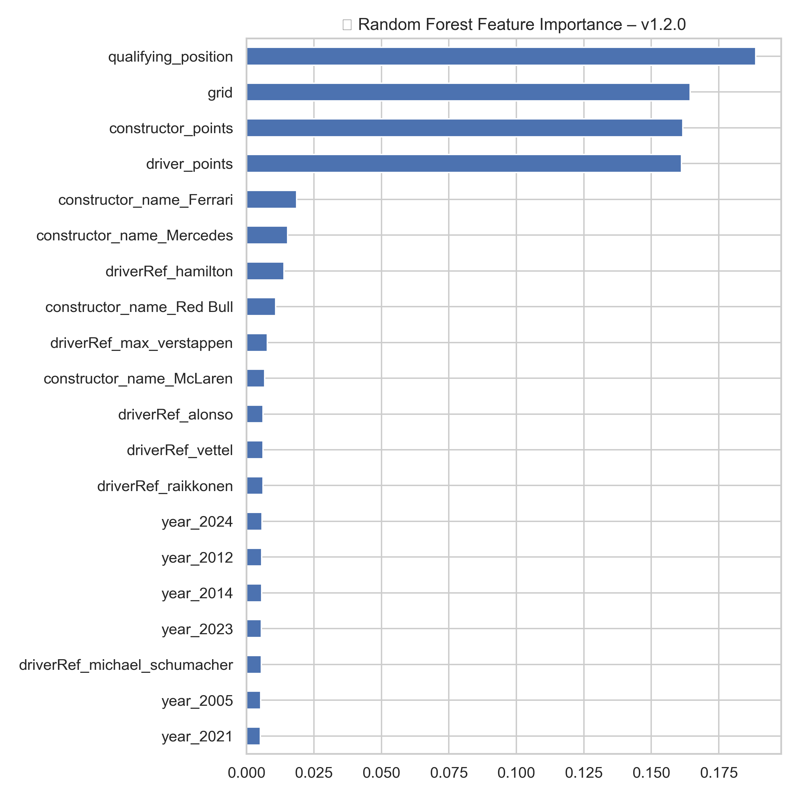
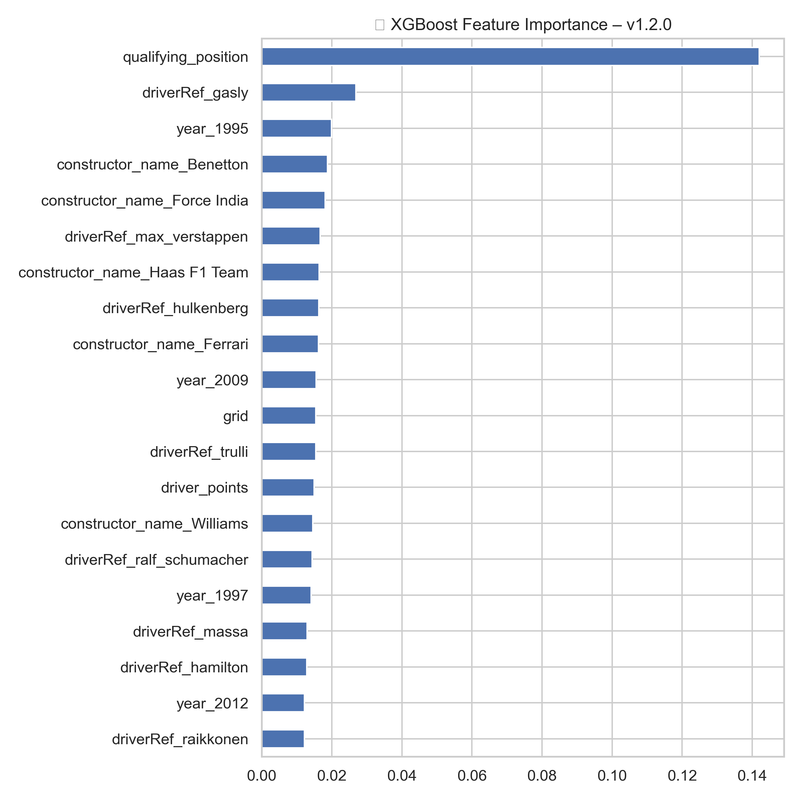

# 🏎️ Formula 1 Podium Prediction

This project uses historical Formula 1 race data to build machine learning models that predict whether a driver will finish on the **podium (Top 3)**. It demonstrates the full ML lifecycle: from data exploration and feature engineering to model training, evaluation, and visual interpretation.

---

## 📁 Project Structure

**Project_1_Sports_Prediction/**
- **data/**
  - Formula_1/
    - races.csv  
    - results.csv  
    - drivers.csv  
    - qualifying.csv  
    - driver_standings.csv  
    - constructor_standings.csv  
- **notebooks/**
  - `01_data_exploration.ipynb` → Exploratory Data Analysis  
  - `02_podium_prediction_model.ipynb` → Model training and evaluation  
- **utils/**
  - `evaluate_models.py` → Evaluation and confusion matrix utilities  
- **results/**
  - `confusion_matrix_comparison_v1_2_0.png`  
  - `model_comparison_bar_v1_2_0.png`  
  - `feature_importance_rf_v1_2_0.png`  
  - `feature_importance_xgb_v1_2_0.png`  
- `environment.yml` → Conda environment  
- `.gitignore`  
- `README.md` → This file  

---

## 🎯 Objective

To build a predictive model that estimates whether a Formula 1 driver will finish in the **top 3**, using a mix of performance, team, and event-specific features.

---

## 📊 Data Sources

- Final race results (`results.csv`)  
- Qualifying sessions (`qualifying.csv`)  
- Season standings (`driver_standings.csv`, `constructor_standings.csv`)  
- Driver and constructor metadata (`drivers.csv`, `constructors.csv`)  
- Races (`races.csv`)

---

## 🧠 Feature Engineering

| Feature                         | Description |
|---------------------------------|-------------|
| `grid`                          | Starting grid position  
| `qualifying_position`           | Best qualifying rank  
| `driver_points`                 | Points before the race  
| `constructor_points`            | Constructor’s points before race  
| `laps_completed`                | Whether driver finished the race  
| `fastest_lap_rank`              | Race pace indicator  
| `constructor_standing_position`| Team's rank before race  
| `year_bin`                      | Era grouping (Pre-2010, 2010–2020, Post-2020)  

---

## 🤖 Models Used

- Random Forest Classifier  
- Logistic Regression (with feature scaling)  
- XGBoost Classifier  

---

## 🏆 Results Summary (v1.2.0)

| Model               | Accuracy | Precision | Recall | F1 Score |
|---------------------|----------|-----------|--------|----------|
| **XGBoost**          | 0.893    | 0.655     | 0.558  | **0.603** |
| Logistic Regression | 0.890    | **0.656** | 0.509  | 0.574    |
| Random Forest       | 0.882    | 0.614     | 0.501  | 0.552    |

---

## 🔍 Confusion Matrix Comparison

This visualization compares the classification performance of all three models:

- ✅ **True Positives** → Correctly predicted podium finishes  
- ⚠️ **False Negatives** → Missed podiums  
- ✅ **True Negatives** → Correct non-podiums  

---

## 📊 Model Comparison – Bar Chart

Shows Accuracy, Precision, Recall, and F1 Score for each model:

---

## 🌟 Feature Importance

### 🔍 Random Forest

Shows which features contributed most to predictions in the RF model.

### ⚡ XGBoost

Highlights top predictive features, including newly engineered ones like `fastest_lap_rank`.

---

## 🧰 Tools & Libraries

- Python 3.11 (Anaconda)  
- pandas, matplotlib, seaborn  
- scikit-learn, xgboost  

---

## 🧪 Evaluation Utilities

Found in [`utils/evaluate_models.py`](./utils/evaluate_models.py):
- Evaluation metrics for multiple models  
- Confusion matrix visualizations  
- Reusable and clean

---

## 🧾 Version History

| Version | Date       | Summary                                                        |
|---------|------------|----------------------------------------------------------------|
| 1.0.0   | 2025-04-07 | Baseline model, EDA, first features, initial evaluation        |
| 1.1.0   | 2025-04-08 | Evaluation module, confusion matrix visuals, formatted README  |
| 1.2.0   | 2025-04-09 | 🚀 New features, model retraining, visualizations, better recall|

---

## ✍️ Author

**Mantas** – Data Scientist & Formula 1 enthusiast  
🔗 [GitHub Profile](https://github.com/mantas123456)
"""

# Save it to README.md
readme_output_path = Path("Project_1_Sports_Prediction/README.md")
readme_output_path.parent.mkdir(parents=True, exist_ok=True)
readme_output_path.write_text(readme_final.strip())

readme_output_path.as_posix()
